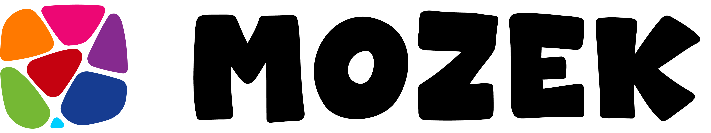

<div align="center">
    

# Mozek UI: Easy & Beautiful Angular Components

[](https://angular.io/)
[](https://www.npmjs.com/package/mozek-angular)
[](LICENSE)

[**Live Demo Playground**](https://thecodemeor.github.io/mozek-website/showcase) • [**Easy Documentation**](https://thecodemeor.github.io/mozek-website)

</div>

---

## 👋 Hey there, Angular Coder!

Welcome to **Mozek**. If you're tired of making buttons from scratch or struggling with complex styling, you're in the right place.

**Mozek** is your go-to toolkit of ready-made Angular components — think buttons, inputs, and cards — all dressed up in stunning style! It's built with the latest Angular features, so you get to pick up best practices while creating something that actually looks amazing.

---

## ✨ Why use Mozek?

- **Ready-to-Go**: No more writing hundreds of lines of CSS. Just drop a component and it looks great.
- **Signal-Powered**: We use Angular **Signals**. It's the modern way to handle data updates. It makes your app fast and your code cleaner.
- **Standalone**: Every component is "Standalone." This means you don't need complex Modules—just import what you need and go!
- **Beautiful by Default**: We use a "Glass" look (translucency and blurs) that makes any app look premium immediately.

---

## 🚀 Get Started in 3 Steps

### 1. Install it

Open your terminal in your project folder and run:

```bash
npm install mozek-angular
```

### 2. Import a component

Open your component file (e.g., `app.component.ts`) and add Mozek to the `imports` list.

```typescript
import { MozButton, MozInput } from "mozek-angular"; // 1. Import it

@Component({
  selector: "app-root",
  standalone: true,
  imports: [MozButton, MozInput], // 2. Add it here
  templateUrl: "./app.component.html",
})
export class AppComponent {}
```
### 4. Add global styles

In your global SCSS file (e.g., `styles.scss`), import Mozek's styles:

```scss
@use "mozek-angular/src/styles" as moz;
```


### 3. Use it in your HTML

Now you can use the tags in your template!

```html
<!-- app.component.html -->
<div class="my-container">
  <h1>Welcome to my App</h1>

  <!-- A cool glass-style input -->
  <moz-input label="What is your name?" placeholder="Type here..." />

  <!-- A pretty button with a hover effect -->
  <moz-button model="glass" color="primary">Click Me!</moz-button>
</div>
```

---

## 📚 What's inside the box?

We have everything you need to build a real app:

- **Buttons**: `MozButton`, `MozButtonIcon`
- **Forms**: `MozInput`, `MozSelect`, `MozCheckbox`, `MozRadio`, `MozSwitch`
- **Pickers**: `MozDatepicker`
- **Navigation**: `MozBreadcrumbs`, `MozPagination`
- **Feedback**: `MozSnackbar`, `MozTooltip`, `MozProgress`
- **Structure**: `MozCard`, `MozAccordion`, `MozBadge`, `MozDivider`
- **And more**: Check the [Full Component List](https://thecodemeor.github.io/mozek-website)

---

## 🎓 Extra-Tip for Beginners

Mozek is built with **Signals**. If you're new to Angular, Signals are like "super-variables" that tell Angular exactly when something changes.

When you use Mozek, you're using the most modern version of Angular possible. It's a great way to "learn by doing!"

---

## 📜 License

Mozek is open-source and free to use under the **MIT license**.

**Happy coding!** Have fun building your next big idea. 🥾

<div align="center">
    <sub>Built with ❤️ for the next generation of Angular Developers.</sub>
</div>
